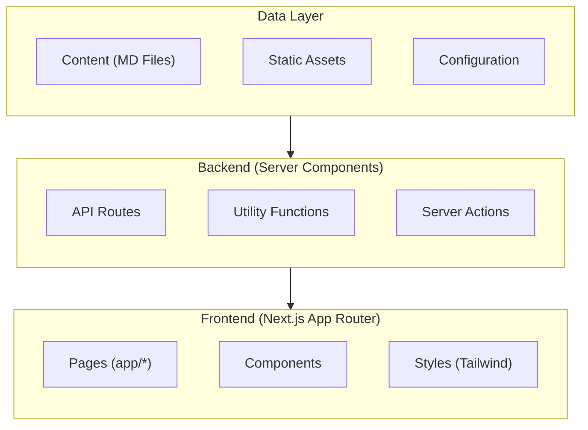
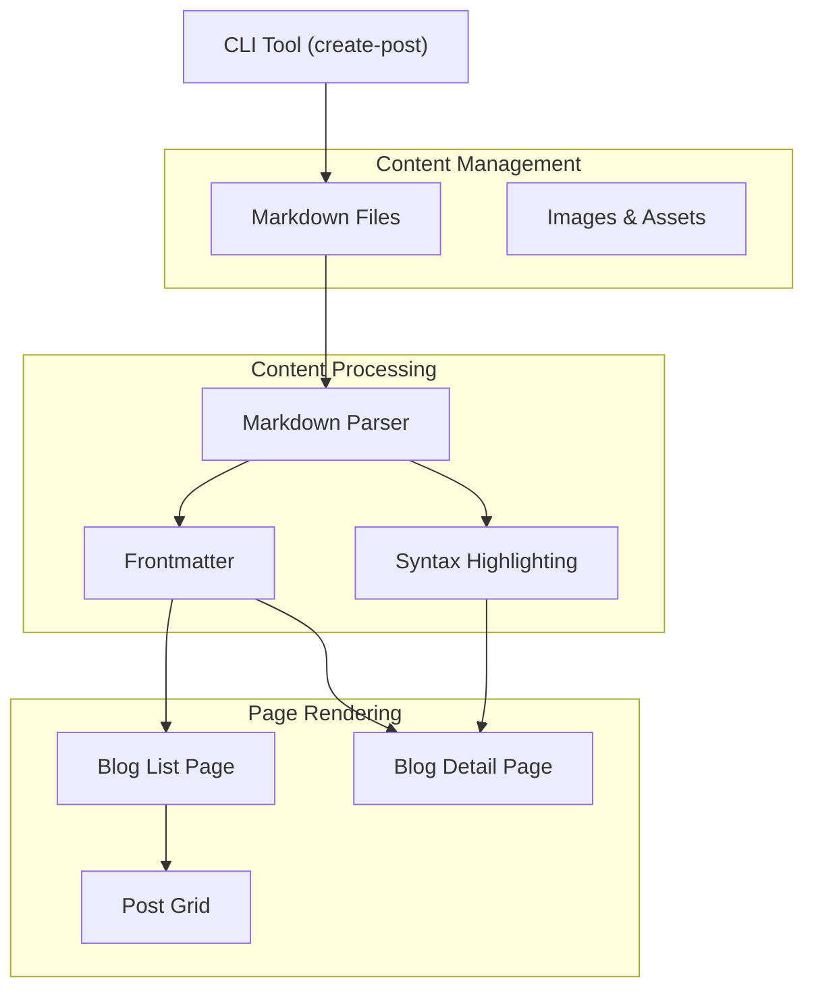
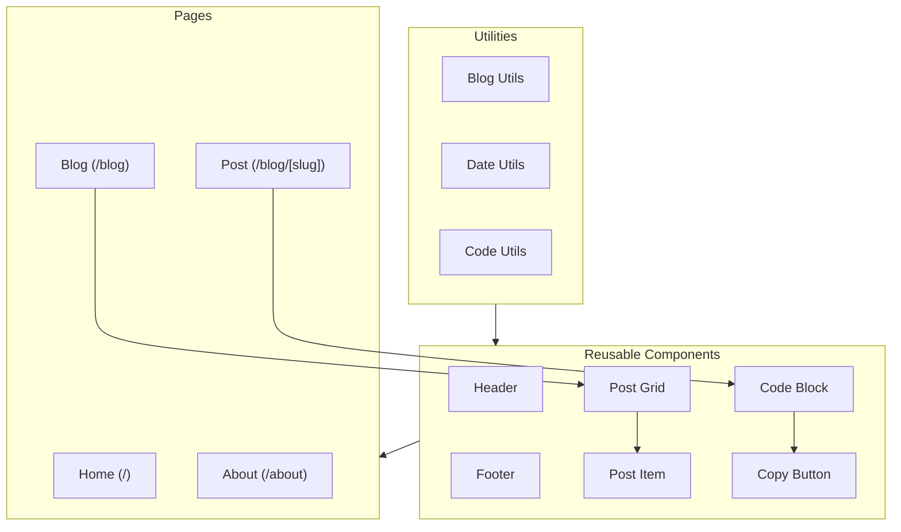
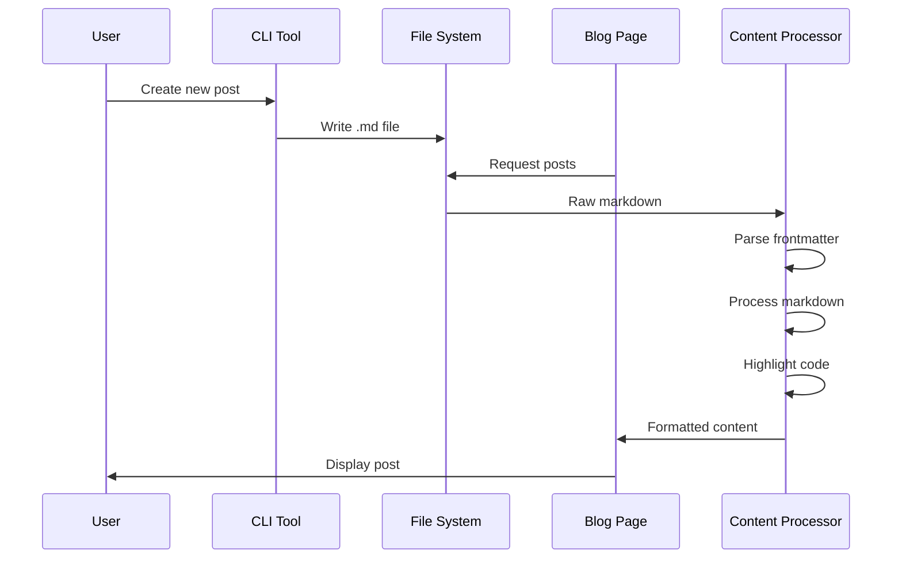
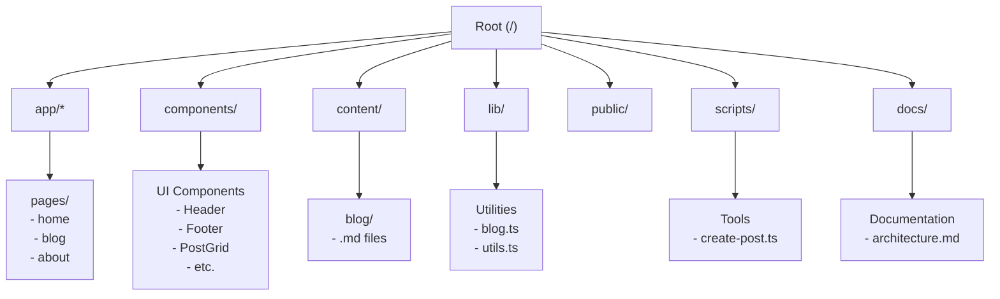

# Website Architecture Documentation

This document provides a comprehensive visual guide to our Next.js website's architecture using Mermaid diagrams.

## Table of Contents

1. [Core Architecture](#core-architecture)
2. [Blog System Flow](#blog-system-flow)
3. [Component Architecture](#component-architecture)
4. [Data Flow](#data-flow-for-blog-posts)
5. [Directory Structure](#directory-structure)

## Core Architecture

## Blog System Flow

## Component Architecture

## Data Flow for Blog Posts

## Directory Structure

## Implementation Details

The website follows a clean architecture where:

1. **Content Management**
   - Blog posts are stored as Markdown files
   - Each post has frontmatter metadata
   - Posts support syntax highlighting
   - CLI tool ensures consistent post creation

2. **Server Components**
   - Handle data processing and rendering
   - Process Markdown to HTML
   - Manage post metadata
   - Sort and filter posts

3. **Client Components**
   - Manage user interactions
   - Handle copy-to-clipboard functionality
   - Provide responsive layouts
   - Implement navigation

4. **Utilities**
   - Shared functions for common operations
   - Date formatting
   - File system operations
   - Type definitions

All code is written in TypeScript and follows functional programming principles for maintainability and type safety.
